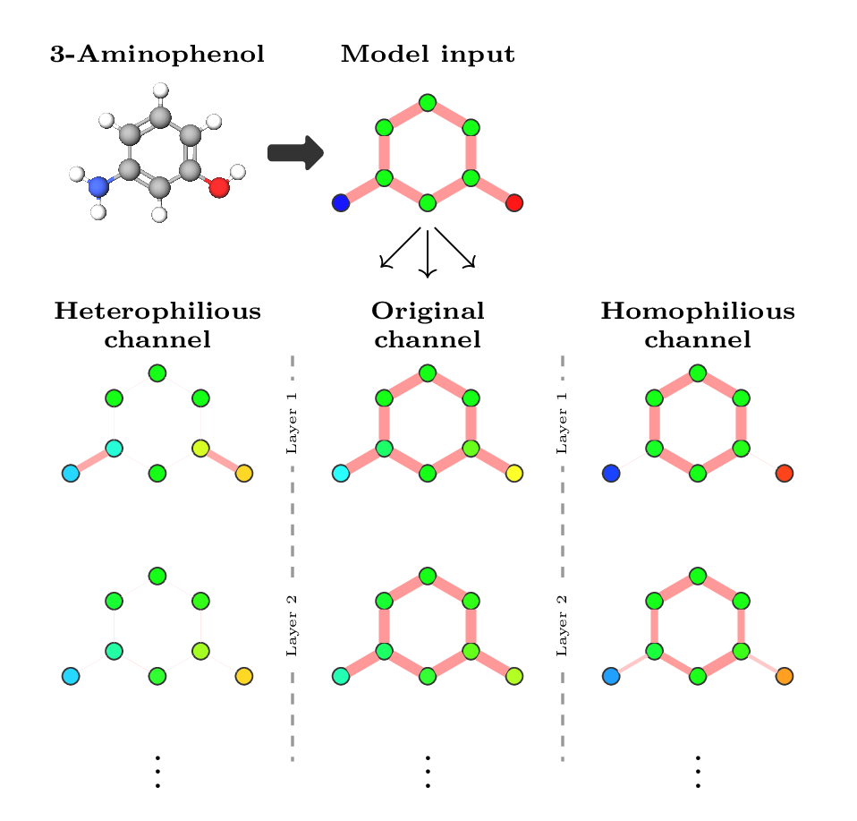

<div align="center">

  # <strong> Heterophily-informed Message Passing </strong>

  <p align="center">
    <a href="https://haishan-wang.github.io">Haishan Wang</a> ·
    <a href="https://users.aalto.fi/~asolin/">Arno Solin</a> .
    <a href="https://quml.aalto.fi/author/vikas-garg/">Vikas Garg</a> 
  </p>

  <h2 align="center">TMLR 2025</h2>
  <h3>
    <a href="https://arxiv.org/abs/2504.19785">Paper</a> 
  </h3>

</div>

---

This is the public codes for TMLR2025 paper: "Heterophily-informed Message Passing"

<div align="center">
  
  <p> Comparison of heterophiliy-informed MP with traditional GNN </p>
</div>

## Experiment 1: Node classification
Get into the experiment directory of node classification at first:
```
cd node_classification
```
### 1) Environment setup
The environment of node classification experiment is installed by the following command
```
conda env create -f environment.yml 
conda activate himp-nc
```
### 2) Dataset 
The data is donwloaded automatically if you run the training script.


### 3) Training the model
This is how to train a GNN model with different versions of message passing
```
python main.py  --data_name ${dataname} --model_name ${gnn} --het_mode ${het_mode} --save_dir ${save_dir}
```
The arguments notes:
- `--data_name`, the name of dataset. Options: `( Cora CiteSeer PubMed Cornell Texas Wisconsin Computers Photo Chameleon Squirrel Roman-empire Amazon-ratings Minesweeper Tolokers Questions )`
- `--model_name`, the GNN types. Options: `( GCN GAT GIN GraphSAGE )`
- `het_mode`, the heterophily-preference of message passing. Options: `( original heterophily homophily mix )`
- `save_dir`, the path of running result, including the metric of best model, and trained model.
One example script for running `GCN+het.` on Cora dataset:
```
source scripts/example_nc.sh
```

## Experiment 2: Molecular generation
Get into the experiment directory of molecular generation at first:
```
cd molecule_generation
```
### 1) Environment setup
```
conda env create -f environment.yml 
conda activate hetflow
```

### 2) Dataset preprocess 
Preprocess SMILES strings to be molecular graphs
```
python data/data_preprocess.py --data_name qm9
python data/data_preprocess.py --data_name zinc250k
```
### 3) Training


### 4) Evaluation 